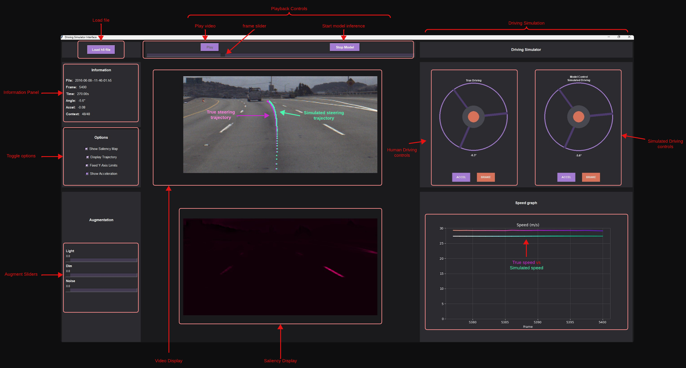

# 🎮 GUI Driving Simulator


*See full image [here](https://drive.google.com/file/d/1g5wuwwutD2lAe6sXzzmIfY4dm1mLphKv/view?usp=sharing)*

## Interactive real-time driving simulator featuring:

- **Purple/Magenta trajectory**: Ground truth (human driving)
- **Cyan/Turquoise trajectory**: Model predictions
- **Dual driving controls**: True vs Simulated control
- **Saliency maps**: Visual attention using VisualBackProp [1]
- **Speed/Acceleration graphs**: Real-time telemetry visualisation

## ⚠️ GUI Limitations

- Memory optimisation for large video files still in progress
- Currently compatible only with Comma.ai dataset 
- Future updates will support alternative video datasets


# 📁 Project Structure
## Main Scripts

- `training_script.py` - Model training pipeline with LTC architecture *(See report for current training pipeline, and future plans for modifications)*
- `gui.py` - Main GUI launcher (defaults to `gui_alt` implementation)
- `evaluation_script.py` - Model evaluation on validation/test segments from the dataset; you may need to modify `train_files`, `val_files`, `test_files` in `video_preprocess.py` if you use different file names, however ensure both the camera and corresponding labels hae the exact same name

## Folders

- `LTC/`

    - `model/` - Core LTC implementation

        - `ltccell.py` - Single timestep LTC cell
        - `ltc.py` - Multi-timestep LTC wrapper
        - `convLTC.py` - CNN+LTC hybrid model
        - `conv_head.py` - Convolutional feature extractor
        - `neural_wiring.py` - Neural Circuit Policy wiring
        - `model_visualisation.py` - Architecture visualisation


    - `checkpoint_weights/` - Trained model weights; Only contains the most recent trained model for demo; you may train your own configuration by modifying the `training_script.py`
    - `training_metrics/` - Training history logs


- `gui/` - Original GUI implementation (no speed simulation); Change import to `gui.gui_main` in `gui.py` to use this version. Its more efficient for faster real-time inference due to the absence of speed simulation, so use this if your device cannot effectively handle the alternative version
- `gui_alt/` - Enhanced GUI with speed simulation (default); Is not optimised at this stage due to several calculations occuring per frame, future updates will aim to optimise and scale this version for advanced simulation use-cases

    - `gui_main.py` - Main GUI application
    - `driving_sim.py` - Steering wheel and pedal controls
    - `speed_graph.py` - Real-time telemetry plotting
    - `model_handler.py` - Model inference interface
    - `gui_backend.py` - Video processing utilities
    - `steering_trajectory.py` - Trajectory visualisation


- `data_preprocessing/`

    - `dataset_loader.py` - Memory-efficient data loading; *(See report for current training pipeline)*
    - `video_preprocess.py` - Frame processing and augmentation
    - `training_utilities.py` - Training helper functions
    - `model_utilities.py` - Model loading and evaluation

- `images/` - Architecture diagrams and visualisations, and GUI annotation
- `datasets/` - Dataset directory structure; *Note: When you download the dataset or some samples, you will need to put the matching camera and log files in the `camera` and `label` folders in order for the processing to work for training, evaluation & GUI; You can put them in any of the split directories (`train`, `val`, `test`), but it's better to follow [our split](https://docs.google.com/document/d/1sW7-s6-jm6F5XbAqSRWovCtqvKfmbWxcyL32NgQG30I/edit?usp=sharing) just for set up purposes, then if you change it around, you will modify the file constants in `video_preprocess.py`
```
datasets/
└── Comma_ai_dataset/
    ├── train/
    │   ├── camera/
    │   └── labels/
    ├── val/
    └── test/
```

 ### ⚠️ Dataset files not included - download from link


# 🚀 Getting Started

- Download dataset from the link and organise into existing directory set up
- Run GUI: `gui.py` (uses `gui_alt` by default)
- Train model: `training_script.py`
- Evaluate: `evaluation_script.py`

To use the older GUI without speed simulation, modify `gui.py`:
```
from gui.gui_main import VideoGui  #instead of gui_alt.gui_main
```

# 🔄 Current Limitations & Next Steps
## Limitations:

- Model lacks understanding of consequences based on driving decision (i.e acceleration & brake predictions are handled, but the speed magnitude is ignored- which is unsafe for sharp or small turns or hazard forecasting)
- Limited to highway scenarios with current training data
- No explicit human intervention detection

## Next Steps:

- Implement human handover protocols to prevent model control during human intervention (i.e lane switching, highway exit, rural navigation)
- Extend dataset diversity (weather, road types, traffic conditions); Current dataset only contains ~6 hours of driving footage in total which is not enough for real-world deployment
Add dedicated human intervention detection branch
- Optimise GUI for faster simulation and implement new simulation experiments


# 📚 References

- [1] Bojarski, M., et al. (2017). [VisualBackProp: efficient visualization of CNNs](https://arxiv.org/pdf/1611.05418)

*See full reference list in report*

---

### 📄 For detailed implementation, experimental results, and comprehensive analysis, please refer to the [Full Project Report](https://docs.google.com/document/d/1mZLEZwRek-2oWJMrC03CmJ7OBZdEgZl2rhWGWmrzpeE/edit?usp=sharing)
---
