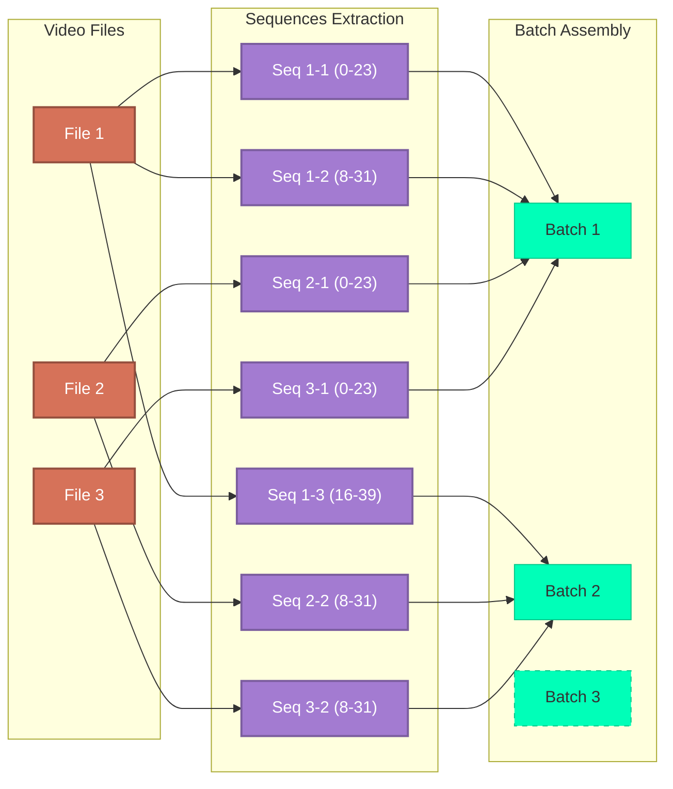

# Visualisation of batch sequences  during training

```mermaid
flowchart LR
    subgraph "Video Files"
        File1["File 1"]
        File2["File 2"]
        File3["File 3"]
    end
    
    subgraph "Sequences Extraction"
        File1 --> Seq1_1["Seq 1-1 (0-23)"]
        File1 --> Seq1_2["Seq 1-2 (8-31)"]
        File1 --> Seq1_3["Seq 1-3 (16-39)"]
        
        File2 --> Seq2_1["Seq 2-1 (0-23)"]
        File2 --> Seq2_2["Seq 2-2 (8-31)"]
        
        File3 --> Seq3_1["Seq 3-1 (0-23)"]
        File3 --> Seq3_2["Seq 3-2 (8-31)"]
    end
    
    subgraph "Batch Assembly"
        Batch1["Batch 1"]
        Batch2["Batch 2"]
        Batch3["Batch 3"]
    end
    
    Seq1_1 --> Batch1
    Seq1_2 --> Batch1
    Seq2_1 --> Batch1
    Seq3_1 --> Batch1
    
    Seq1_3 --> Batch2
    Seq2_2 --> Batch2
    Seq3_2 --> Batch2
    
    style Batch1 fill:#00ffb8,stroke:#00c88a
    style Batch2 fill:#00ffb8,stroke:#00c88a
    style Batch3 fill:#00ffb8,stroke:#00c88a,stroke-dasharray: 5 5
    
    classDef fileClass fill:#d67259,stroke:#944f3e,stroke-width:2px,color:#fff
    classDef seqClass fill:#a37bd1,stroke:#7b5d9e,stroke-width:2px,color:#fff
    
    class File1,File2,File3 fileClass
    class Seq1_1,Seq1_2,Seq1_3,Seq2_1,Seq2_2,Seq3_1,Seq3_2 seqClass
```