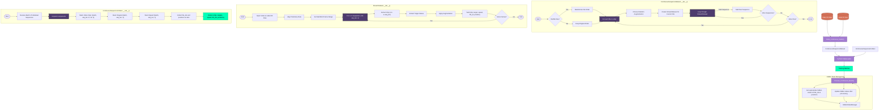

```mermaid
flowchart TD
    %% Data Source
    VideoFiles[(Video H5 Files)] --> MakeContinuousLoader["make_continuous_loader()"]
    LabelFiles[(Label H5 Files)] --> MakeContinuousLoader
    MakeContinuousLoader --> CSD[ContinuousSequenceDataset]
    
    %% Creating DataLoader
    CSD --> TorchDL[PyTorch DataLoader]
    Collator[ContinuousSequenceCollator] --> TorchDL
    TorchDL --> TrainingBatches[Training Batches]
    
    %% Internal Iterator Flow
    subgraph "ContinuousSequenceDataset.__iter__()"
        CSD_Start([Start]) --> ShuffleFiles{"Shuffle Files?"}
        ShuffleFiles -->|Yes| FileOrderShuffle[Randomize File Order]
        ShuffleFiles -->|No| FileOrderKeep[Keep Original Order]
        FileOrderShuffle --> CSD_FileLoop[For each file in order]
        FileOrderKeep --> CSD_FileLoop
        
        CSD_FileLoop --> CSD_AugmentChoice[Choose Random Augmentation]
        CSD_AugmentChoice --> CSD_CreateStream[Create StreamDataset for Current File]
        
        CSD_CreateStream --> CSD_StreamLoop[Loop through StreamDataset]
        CSD_StreamLoop -->|Yield Sequence| CSD_YieldNext[Yield Next Sequence]
        CSD_YieldNext --> CSD_CheckMore{More Sequences?}
        CSD_CheckMore -->|Yes| CSD_StreamLoop
        CSD_CheckMore -->|No| CSD_NextFile{More Files?}
        CSD_NextFile -->|Yes| CSD_FileLoop
        CSD_NextFile -->|No| CSD_End([End])
    end
    
    %% StreamDataset Processing
    subgraph "StreamDataset.__iter__()"
        Stream_Start([Start]) --> OpenFiles[Open Video & Label H5 Files]
        OpenFiles --> AlignTelemetry[Align Telemetry Data]
        AlignTelemetry --> SetRange[Set Start/End Frame Range]
        
        SetRange --> SequenceLoop["For s in range(start, end-seq_len+1)"]
        SequenceLoop --> ExtractClip["Extract Clip (s to s+seq_len)"]
        ExtractClip --> ExtractTargets[Extract Target Values]
        ExtractTargets --> ApplyAugment[Apply Augmentation]
        ApplyAugment --> Stream_Yield["Yield (clip, target, speed, file_id, position)"]
        
        Stream_Yield --> MoreFrames{More Frames?}
        MoreFrames -->|Yes| SequenceLoop
        MoreFrames -->|No| Stream_End([End])
    end
    
    %% Collator Process  
    subgraph "ContinuousSequenceCollator.__call__()"
        Collator_Start([Start]) --> ReceiveSequences["Receive Batch of Individual Sequences"]
        ReceiveSequences --> UnpackComponents[Unpack Components]
        UnpackComponents --> StackClips["Stack Video Clips: [batch, seq_len, H, W, C]"]
        StackClips --> StackTargets["Stack Targets: [batch, seq_len, 2]"] 
        StackTargets --> StackSpeed["Stack Speed: [batch, seq_len, 1]"]
        StackSpeed --> CollectMetadata["Collect file_ids and positions as lists"]
        CollectMetadata --> ReturnBatch["Return (clips, targets, speed, file_ids, positions)"]
    end
    
    %% Connect Training Process
    TrainingBatches --> Process["Process_Continuous_Batch()"]
    
    %% Hidden State Continuity
    subgraph "Hidden State Management"
        HSManager[HiddenStateManager]
        Process --> GetHidden["Get appropriate hidden states via file_ids & positions"]
        GetHidden --> HSManager
        HSManager --> Process
        Process --> UpdateHidden["Update hidden states after processing"]
        UpdateHidden --> HSManager
    end
    
    %% Styling
    classDef dataSource fill:#d67259,stroke:#944f3e,stroke-width:2px,color:#fff
    classDef process fill:#a37bd1,stroke:#7b5d9e,stroke-width:2px,color:#fff
    classDef iterator fill:#4e3b6e,stroke:#2C2C30,stroke-width:2px,color:#fff
    classDef batch fill:#00ffb8,stroke:#00c88a,stroke-width:2px,color:#000
    
    class VideoFiles,LabelFiles dataSource
    class MakeContinuousLoader,TorchDL,Process process
    class CSD_FileLoop,CSD_StreamLoop,SequenceLoop,UnpackComponents iterator
    class TrainingBatches,ReturnBatch batch
```