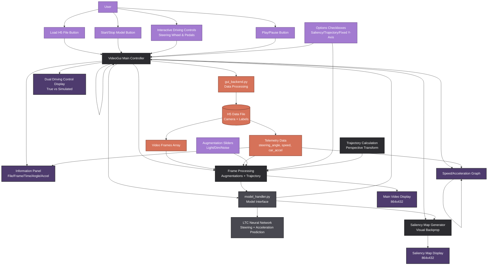

```mermaid
graph TB
    %% User Interactions
    User[User] 
    LoadBtn[Load H5 File Button]
    PlayBtn[Play/Pause Button]
    ModelBtn[Start/Stop Model Button]
    Sliders[Augmentation Sliders<br/>Light/Dim/Noise]
    Checkboxes[Options Checkboxes<br/>Saliency/Trajectory/Fixed Y-Axis]
    DrivingControls[Interactive Driving Controls<br/>Steering Wheel & Pedals]

    %% Main Controller
    VideoGui[VideoGui Main Controller]
    
    %% Data Layer
    H5File[(H5 Data File<br/>Camera + Labels)]
    Backend[gui_backend.py<br/>Data Processing]
    Frames[Video Frames Array]
    Telemetry[Telemetry Data<br/>steering_angle, speed, car_accel]
    
    %% Model Layer
    ModelHandler[model_handler.py<br/>Model Interface]
    LTCModel[LTC Neural Network<br/>Steering + Acceleration Prediction]
    
    %% Display Components
    VideoDisplay[Main Video Display<br/>864x432]
    SaliencyDisplay[Saliency Map Display<br/>864x432]
    InfoPanel[Information Panel<br/>File/Frame/Time/Angle/Accel]
    SpeedGraph[Speed/Acceleration Graph]
    DualDriving[Dual Driving Control Display<br/>True vs Simulated]
    
    %% Processing Functions
    FrameProcessor[Frame Processing<br/>Augmentations + Trajectory]
    SaliencyGen[Saliency Map Generator<br/>Visual Backprop]
    TrajectoryCalc[Trajectory Calculation<br/>Perspective Transform]
    
    %% Data Flow - File Loading
    User --> LoadBtn
    LoadBtn --> VideoGui
    VideoGui --> Backend
    Backend --> H5File
    H5File --> Frames
    H5File --> Telemetry
    
    %% Data Flow - Display Update
    VideoGui --> FrameProcessor
    Frames --> FrameProcessor
    Telemetry --> FrameProcessor
    Sliders --> FrameProcessor
    FrameProcessor --> VideoDisplay
    
    %% Data Flow - Model Inference
    User --> ModelBtn
    ModelBtn --> VideoGui
    VideoGui --> ModelHandler
    ModelHandler --> LTCModel
    FrameProcessor --> ModelHandler
    ModelHandler --> VideoGui
    
    %% Data Flow - Interactive Controls
    User --> DrivingControls
    DrivingControls --> VideoGui
    VideoGui --> DualDriving
    
    %% Data Flow - Playback
    User --> PlayBtn
    PlayBtn --> VideoGui
    VideoGui --> VideoGui
    
    %% Data Flow - Saliency
    Checkboxes --> VideoGui
    VideoGui --> SaliencyGen
    ModelHandler --> SaliencyGen
    SaliencyGen --> SaliencyDisplay
    
    %% Data Flow - Trajectory
    Checkboxes --> FrameProcessor
    TrajectoryCalc --> FrameProcessor
    
    %% Data Flow - Speed Graph
    VideoGui --> SpeedGraph
    Telemetry --> SpeedGraph
    SpeedGraph --> SpeedGraph
    
    %% Data Flow - Info Panel
    VideoGui --> InfoPanel
    Telemetry --> InfoPanel
    
    %% Styling
    classDef userInterface fill:#a37bd1,stroke:#7b5d9e,stroke-width:2px,color:#fff
    classDef dataLayer fill:#d67259,stroke:#944f3e,stroke-width:2px,color:#fff
    classDef modelLayer fill:#484850,stroke:#2C2C30,stroke-width:2px,color:#fff
    classDef displayLayer fill:#4e3b6e,stroke:#2C2C30,stroke-width:2px,color:#fff
    classDef processLayer fill:#2C2C30,stroke:#1A1A1C,stroke-width:2px,color:#fff
    
    class User,LoadBtn,PlayBtn,ModelBtn,Sliders,Checkboxes,DrivingControls userInterface
    class H5File,Frames,Telemetry,Backend dataLayer
    class ModelHandler,LTCModel modelLayer
    class VideoDisplay,SaliencyDisplay,InfoPanel,SpeedGraph,DualDriving displayLayer
    class VideoGui,FrameProcessor,SaliencyGen,TrajectoryCalc processLayer
```